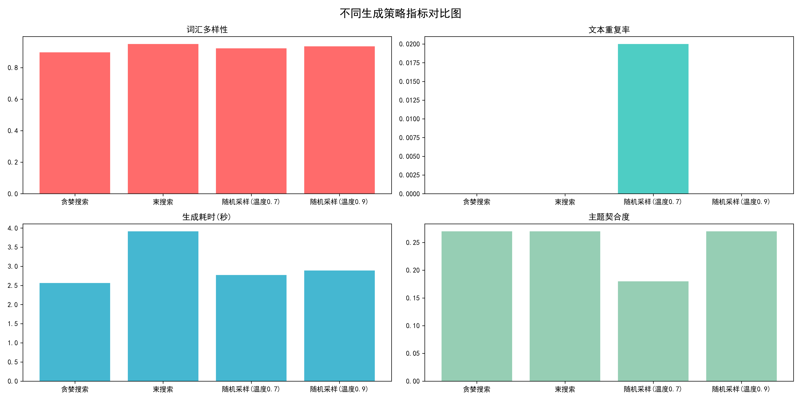

# GPT2-Controllable-Text-Generation
NLP课程期末项目：基于中文GPT2实现可控文本生成——解码策略与采样温度的对比实验分析

---

## 项目简介
本项目为NLP课程期末实训项目，以轻量级中文GPT-2预训练模型 `uer/gpt2-chinese-cluecorpussmall` 为基础，构建了一套完整的可控文本生成实验框架。项目使用**清晨窗台温情风格小样本数据集**进行6轮模型微调，核心目标是通过多组对照实验，系统探究**解码策略**与**采样温度**两大关键因素对中文文本生成效果的影响规律，深入理解自回归语言模型的生成机制与行为边界，为中文可控文本生成任务提供可复现的实验参考。

---

## 实验内容
- **解码策略对比实验**：对比贪婪搜索、束搜索、随机采样三种生成策略在中文温情文本续写任务中的表现差异
- **采样温度梯度实验**：设置两组温度参数（0.7 / 0.9），探究温度系数对生成文本风格、多样性与逻辑性的影响
- **多维度效果评估**：从文本流畅度、主题一致性、内容多样性、语句重复率、生成耗时五个维度进行综合量化评价
- **实验结果可视化**：通过柱状图直观呈现不同参数下的文本生成效果差异，自动输出实验报告与可视化图表

---

## 运行环境
- Python 3.9
- PyTorch
- Transformers
- Datasets
- Matplotlib
- 其他依赖：collections, time, math, os, IPython

---

## 运行方式
1.  **完整项目一键运行**：直接打开并执行 `nlp_project3.ipynb`，即可完成从模型加载、微调训练、多参数文本生成到结果可视化的全流程实验。
2.  **实验结果快速查看**：
    - 不同参数下的文本续写结果：`续写实验结果.txt`
    - 多组实验效果对比可视化图：`续写实验对比图.png`

---

## 核心结论
1.  **解码策略的表现差异**
    - **贪婪搜索**：生成速度较快，文本语法严谨、无重复内容，主题一致性表现稳定，但输出风格偏通用化，创新性较弱。
    - **束搜索**：生成语句简洁流畅、连贯性最优，无语法错误，耗时略高于其他策略，风格保守且规整。
    - **随机采样**：文本多样性与创意性显著提升，词汇丰富度更高，是本次实验中表现力最优的生成策略。

2.  **采样温度的影响规律**
    - **温度0.7**：生成内容描述性较强，细节丰富，但会轻微偏离温情主题，主题契合度略低。
    - **温度0.9**：生成文本文艺流畅，保持了高主题一致性与词汇多样性，无逻辑混乱、无重复语句，综合表现更优。
    - 两组温度下文本**重复率均极低（0.000~0.020）**，生成质量稳定，未出现乱码、逻辑断裂等问题。

3.  **综合对比与最优方案**
    结合实验数据（模型困惑度PPL=5.121）与可视化结果来看，**随机采样+温度0.9** 的组合在本次温情文本续写任务中表现最优，兼顾了文本的流畅度、多样性与主题一致性；束搜索适合追求文本简洁严谨的场景，贪婪搜索适合确定性要求高的基础生成场景。

---

## 可视化展示

---

### 补充说明
- 本项目所有代码与实验过程均为课程实训独立完成，实验结果可通过 `nlp_project3.ipynb` 完整复现。
- 所有生成的文本结果已整理至 `续写实验结果.txt`，可直接查看不同参数下的续写效果。
- 项目严格遵循控制变量法设计实验，所有对比实验均固定了输入Prompt与生成长度，保证了实验结论的可靠性。
- 模型采用6轮小样本微调完成训练，最终困惑度为5.121，语言建模效果符合预期。
